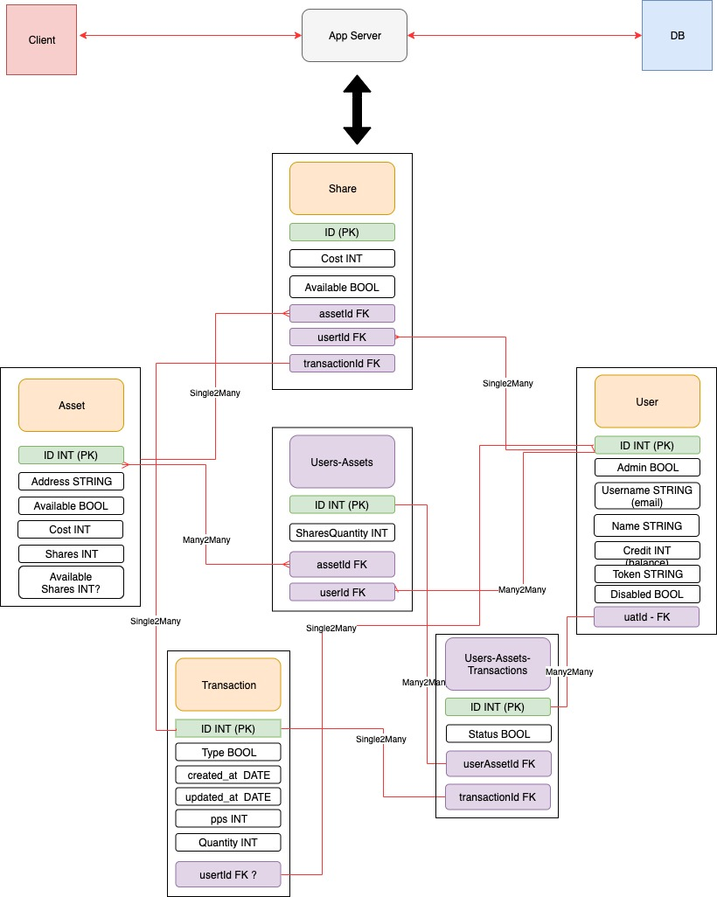

# Mini Landa Exercise

***In this repository I developed an End-to-End "Mini-Landa" application.***

---
## Instructions:

### 1. Create a simple webpage in which you can set a price, an amount, and click a button to buy/sell a share.

**Assume you have _infinite funds_.**
**Assume there is _only 1 type_ of share.**

### 2. Players should be identified via a simple input of nickname (Backend authentication is optional).

**A buy should _only_ increase the share count of the player _if there is a sale at the same or lower price; and if the amount left of the sale is greater than 0_.**

### 3. Have a backend API that serves the webpage and keeps track of the player’s share count (Persistent).

**The player should not be able to sell shares he does not have any.**
**The player should not be able to buy/sell from him/herself.**
**The backend should update the frontend if there is a change in the player’s share count (When there are 2 players, if a player affects the other player's share count, the frontend of the other player should be updated automatically).**

### 4. Create an initial user that holds and sells the initial shares in the system.

---

## Development:

### Backend: Under `Server` directory

#### 1. Web server application based on `NodeJS` & `Postgresql` 
**Dependencies**
- **a. `Express` - For serving API & http requests and routers.**

- **b. `PostgreSQL` - DataBase**

    - **b.1. `Sequelize` - For SQL ORM to minimize vulnerability to SQL injection attacks.**

    - **b.2. `pg` - For PostgreSQL**

    - **b.3. `Umzug` - For migrations**

- **c. `nodemon` - Dev dependecy for automatically restarting the node application when file changes .**

    - **d. `morgan` - Dev dependecy for HTTP request logger middleware.**

    - **e. `dotenv` - To store and serve vulnerable information.**

    - **f. `cors` - For providing a Connect/Express middleware that can be used to enable CORS with various options.**

    - **g. `JWT` - For basic authentication and authorization using tokens.**

    - **h. `heroku` - For basic development db cloud server.**

#### 2. DB Diagram 



#### 3. Models 

- [V] a. User 

    ```json
        "example":
            {
                "id": 1,
                "username": "example@gmail.com", 
                "name": "John Doe",
                "admin": false,
                "disabled": false,
                "token": null,
                "credit": 100,
            }
    ```

- [V] b. Asset 
    ```json
        "example":
            {
                "id": 1,
                "address": "18 Test st, Example Province",
                "available": true,
                "cost": 600000,
                "shares": 10000,
                "availableShares": 350,
            }
    ```       
- [V] c. Share  
    ```json
        "example":
            {
                "id": 1,
                "available": true,
                "cost": 5,
                "user_id": 3,
                "asset_id": 5
            }
    ```   
- [V] d. Transaction 
    ```json
        "example":
            {
                "id": 1,
                "quantity": 70,
                "type": true,
                "pps": 3,
                "user_id": 3,
                "created_at": "Tue Feb 01 2022 00:00:00 GMT+0000",
                "updated_at": "Wed Feb 02 2022 00:00:00 GMT+0000",
            }
    ```     
#### 4.0. CRUD Endpoints & Routers 
- [ ] a. GET `/` - serves the webpage static files. 
    Does not require any authentication to view public data, however to preform actions the user must sign-up or login.  

- [V] b. `/api` - serves api requests. `mainRouter`  

- [V] c0. `/users` - serves user api requests. `usersRouter`
    - [V] c1. POST `/signup` - sign up requests. `signupRouter`
    - [V] c2. POST `/login` - serves api requests. `loginRouter`
    - [V] c3.1. GET `/` - Get all users.
    - [V] c3.2. GET `/:id` - Get user by `id`.
    - [V] c3.3. PUT `/:username` - Update user by `username`. (Admin Only)
    - [V] c3.4. DELETE `/:id` - Delete user by `id`. (Admin Only)

- [ ] d0. `/assets` - serves api requests. `assetsRouter`
    - [V] d.1. GET `/` - Get all assets.
    - [V] d.2. GET `/:id` - Get asset by `id`.
    - [ ] d.3. PUT `/:id` - Update asset by `id`. (Admin Only)
    - [ ] d.4. DELETE `/:id` - Delete asset by `id`. (Admin Only)  

- [ ] e. `/transactions` - serves api requests. `assetsRouter`
    - [ ] e.1. GET `/` - Get all transactions.
    - [ ] e.2. GET `/:id` - Get transaction by `id`.
    - [ ] e.3. POST `/action` - Create a new transaction.
    - [ ] e.3. PUT `/:id` - Update transaction by `id`. (User/Admin Only)
    - [ ] e.4. DELETE `/:id` - Delete asset by `id`. (User/Admin Only) 

- [ ] f. `/shares` - serves api requests. `assetsRouter` 
    - [ ] d.1. GET `/` - Get users shares by assets.
    - [ ] d.2. GET `/:id` - Get users shares by asset `id`.

---
### Frontend: Under `Client` directory

- **2. I created a front-end web application based on `JavaScript` & `React` and also the following npm dependencies: .**

    - **a. `Redux` - Store for components states management.**

    - **b. `Axios` - For client HTTP requests.**

    - **c. `Bootstrap` - For simplified frontend design.**

    - **d. `Live-Server` - A little development server with live reload capability.**
        
    - **2.0. Landig-page: .**
        - [ ] a. HTTP GET - serves the webpage static files. 
        - [ ] b. Does not require any authentication to view public data, however to preform actions the user must sign-up or login.    

    - **2.1. Sign-up page .**
        <!-- - [ ] a. HTTP GET - serves the webpage static files.  -->
        - [ ] b. Simple form that requires a `userName` which is a valid email-address and a `password`.

    - **2.2. Login page .**
        - [ ] a. Simple form that requires a `userName` and `password`.
        - [ ] b. If the client's cradentials are authenticated the user receives a Token, otherwise the website will restrict his actions.

    - **2.3. Functionallity .**
        ***Assuming you have be authenticated and authorized.***
        - [ ] a. GET info - 
        - [ ] b. POST bid - 
        - [ ] c. PUT bid - 


---

